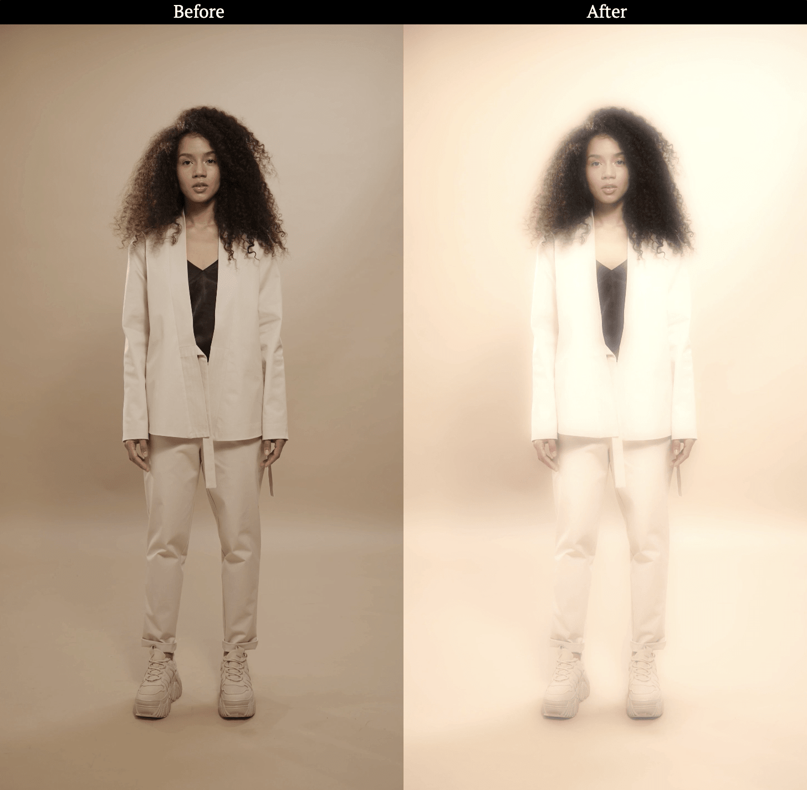

# Inspiration & resources

## FFMpeg

### Vintage glow effect
https://www.reddit.com/r/ffmpeg/comments/im2mkp/creating_a_retro_glow_effect_with_ffmpeg/

``` bash
ffmpeg -i original.mp4 -filter_complex "[0]rgbashift=rh=15:bv=15:gh=-15[rgba-shifted];[rgba-shifted]format=rgba[in2];[in2][0]scale2ref[in2][in1];[in1][in2]blend=overlay[overlay];[overlay]gblur=sigma=42:steps=6[gblur];[gblur]format=yuv420p[in2];[in2][0]scale2ref[in2][in1];[in1][in2]blend=screen" -pix_fmt yuv420p output.mp4
```



## UX/UI

https://uxdesign.cc/ultimate-start-guide-for-beginner-ux-ui-designer-b848be089589


## Audio visualization

Basic equalizer (used for beat detection)
https://medium.com/analytics-vidhya/how-to-create-a-music-visualizer-7fad401f5a69

GANs
https://github.com/JCBrouwer/maua-stylegan2

## Video clips

https://www.youtube.com/watch?v=EAwYvhJinoI

## Code

Auto refresh with Vue JS

https://stackoverflow.com/questions/36572540/vue-js-auto-reload-refresh-data-with-timer
